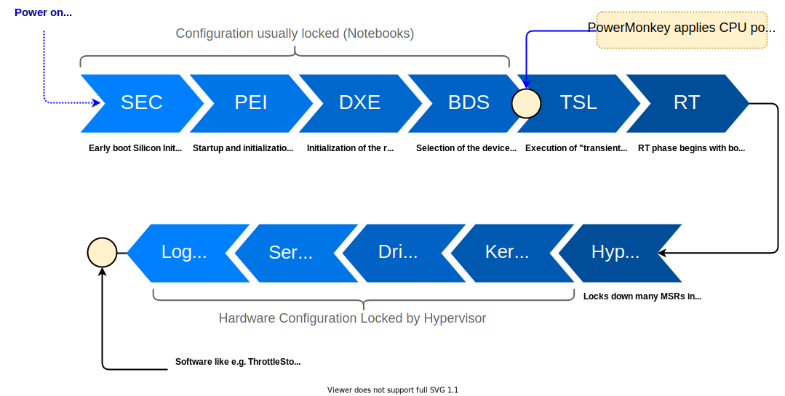
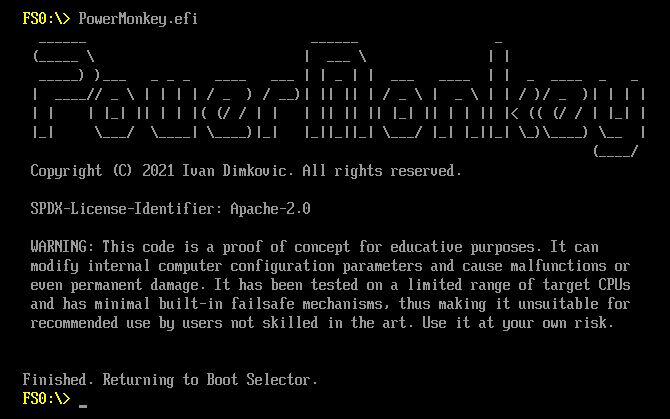
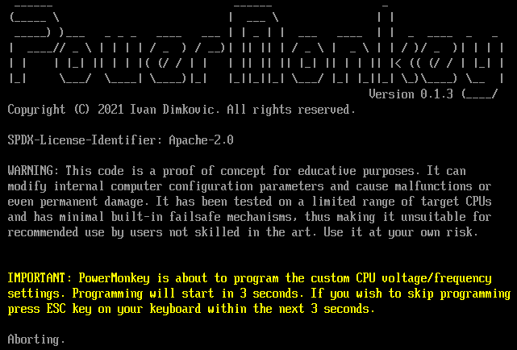
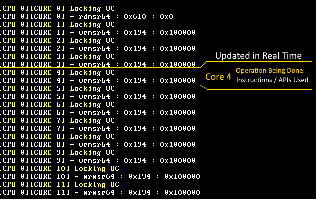
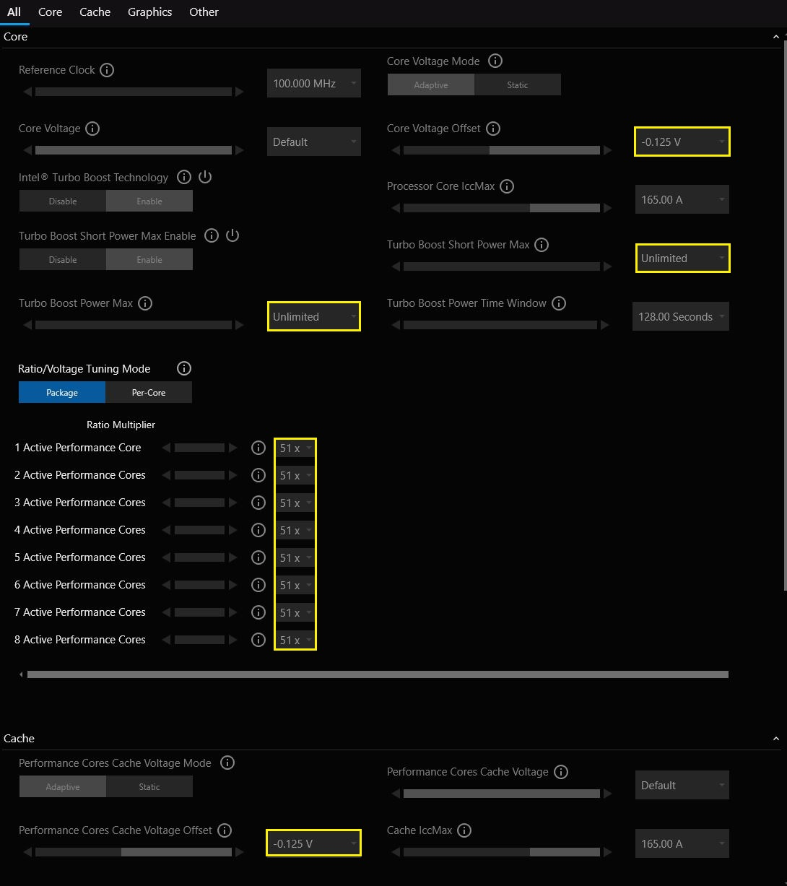
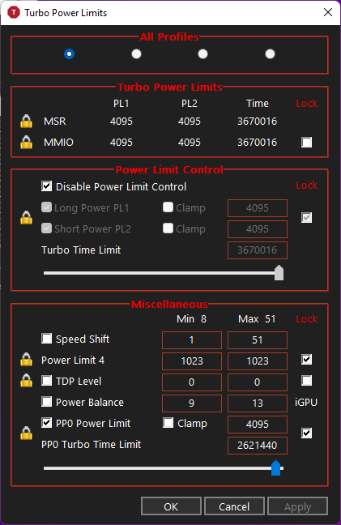
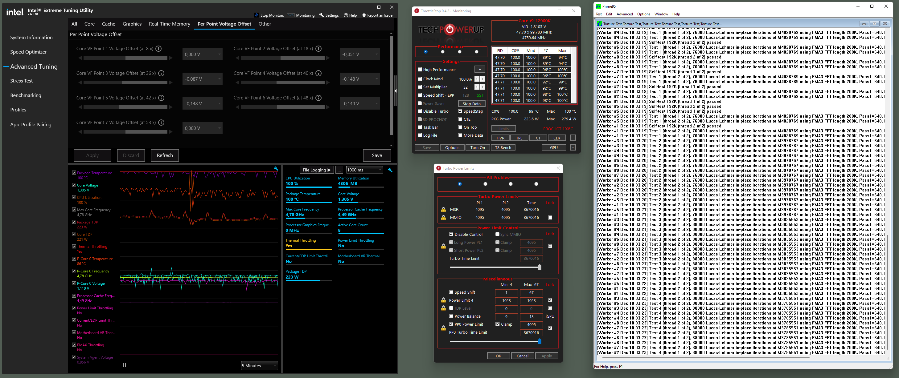

# Reduce CPU Power Waste and Gain Performance - Greener and Meaner

```txt
   ______                            ______                 _
  (_____ \                          |  ___ \               | |
   _____) )___   _ _ _   ____   ___ | | _ | |  ___   ____  | |  _  ____  _   _
  |  ____// _ \ | | | | / _  ) / __)| || || | / _ \ |  _ \ | | / )/ _  )| | | |
  | |    | |_| || | | |( (/ / | |   | || || || |_| || | | || |< (( (/ / | |_| |
  |_|     \___/  \____| \____)|_|   |_||_||_| \___/ |_| |_||_| \_)\____) \__  |
                                                                        (____/
  Copyright (C) 2021-2022 Ivan Dimkovic. All rights reserved.
  
  WARNING: This code is a proof of concept for educative purposes. It can
  modify internal computer configuration parameters and cause malfunctions or
  even permanent damage. It has been tested on a limited range of target CPUs
  and has minimal built-in failsafe mechanisms, thus making it unsuitable for
  recommended use by users not skilled in the art. Use it at your own risk.
```

- [Reduce CPU Power Waste and Gain Performance - Greener and Meaner](#reduce-cpu-power-waste-and-gain-performance---greener-and-meaner)
  - [What is PowerMonkey?](#what-is-powermonkey)
    - [**Background**](#background)
    - [**Challenges**](#challenges)
    - [**How does PowerMonkey work?**](#how-does-powermonkey-work)
  - [Who is the target user of PowerMonkey?](#who-is-the-target-user-of-powermonkey)
  - [Enabled Features](#enabled-features)
  - [Getting Started](#getting-started)
    - [Configuration](#configuration)
    - [Build the binaries](#build-the-binaries)
      - [**Building - "Visual Studio" route:**](#building---visual-studio-route)
      - [**Building - EDK2 route:**](#building---edk2-route)
    - [Deployment](#deployment)
  - [Testing](#testing)
    - [Emergency Exit](#emergency-exit)
    - [**Cannot resolve hanging - Tracing to the Rescue**](#cannot-resolve-hanging---tracing-to-the-rescue)
  - [Real World Results](#real-world-results)
    - [Cinebench R23](#cinebench-r23)
    - [Extra 650 MHz and energy saved? Where is the catch?](#extra-650-mhz-and-energy-saved-where-is-the-catch)
    - [Moving onto Hyper-V](#moving-onto-hyper-v)
    - [**Even Better Undervolting: V/F Point Adjustment**](#even-better-undervolting-vf-point-adjustment)
      - [**Click Here for Detailed Recipe with 12900K Results**](#click-here-for-detailed-recipe-with-12900k-results)
  
## What is PowerMonkey?

### **Background**

By the 2020s, everybody knows what 'overclocking' is: bringing the system to its limits by increasing its working frequency, voltage or both. This process used to be very error-prone but it got perfected in the meantime, with even some big-name systems coming “factory overclocked” out of the box.

However, much fewer people have heard about its cousin: **undervolting**. Undervolting is, in a way, an opposite process from overclocking: reducing CPU voltage to the point, CPU consumes much less power and generates way less heat.

Intriguingly, doing this to the thermally limited system such as a notebook or SFF (small form factor) PC will **both reduce heat AND improve performance!** Magic? No, physics! There is only so much heat a notebook cooling system can evacuate, and once this route becomes exhausted, there is no other option but to throttle the CPU to prevent catastrophic failure. Reducing voltage at high frequencies significantly decreases power and heat output thus making the system cooler **and** faster.

### **Challenges**

Sadly, it has become increasingly difficult to optimize a typical notebook. First, undervolting became mostly locked-by-default by OEMs. This problem can be mitigated by “unlocking” the firmware settings so that excellent applications like [ThrottleStop](https://www.techpowerup.com/download/techpowerup-throttlestop/) can do their job (unless the platform is fully locked).

But new problems are in sight: Hypervisors such as Microsoft Hyper-V are now used even by end-user applications like WSL2 (Windows Subsystem for Linux). Because Hypervisor does not allow a Virtual Machine to modify most of the host hardware registers, applications like ThrottleStop or Intel’s XTU cannot adjust voltages.

When application attempts to write to a hardware register, Hypervisor traps this attempt and does not perform the actual writing. It is  heoretically possible that Hypervisor vendor implements writing, but highly unlikely. This has created new barriers for undervolting and similar types of hardware tweaks.

Nothing above would be a problem if OEMs allowed customers to adjust the settings in the firmware setup. However, most notebooks come with minimal configuration options, locking the owner of being able to adjust their hardware. PowerMonkey POC intends to fix precisely this problem, and this repository is the first “proof-of-concept” showing viability of such an approach.

### **How does PowerMonkey work?**

This proof-of-concept is using ability of UEFI firmwares to execute so-called "applications" before OS bootoader is invoked. At that moment (providing that the firmware did not lock) it is possible to (almost) fully adjust CPU frequency and voltages as well as power management configuration. This is later in the boot process (see below) as opposed to how OEM would do it, but since "advanced setup" is not an option, this is actually the second best place.

***NOTE: PowerMonkey is fully usable only with systems using S0iX ("Connected Standby" / "Modern Standby" / "S0 Standby") modes. Systems using legacy S3 sleep will revert to the platform-hardcoded settings upon resuming from S3 sleep. Since UEFI DXE drivers/applications are not reloaded during S3 resume flow, no overrides could be applied before Hypervisor resumes.***

Below picture explains where PowerMonkey.efi POC resides:



## Who is the target user of PowerMonkey?

PowerMonkey.efi is currently proof-of-concept for expert users who have systems that do not allow Voltage/Frequency override configuration in their firmware setup modules, yet firmware is either OC/CFG unlocked or can be made so by some means (e.g. NVRAM EFI variable editing). Primary purpose of PowerMonkey.efi is to allow V/F overrides on such systems when usage of Hypervisor is also desired.

## Enabled Features

*NOTE: Alder Lake Support is BETA (P-Cores Only, spurious crashes discovered when E-Cores are enabled)*

PowerMonkey is a POC and is **not tested** on anything other than few CML, RKL and ADL* systems.
At this stage, usage is recommended only to developers and experts under precautions. There are no checks for CPU compatibility so crashes could occur. It can brick computers or cause them to fail in all kinds of ways!

|                          Feature                        |    Configurable    |
| ------------------------------------------------------- | ------------------ |
| **Voltage / Frequency Overrides**                       |                    |
|   Voltage Override for entire VF Curve                  |         YES        |
|   Targetted voltage mode                                |         YES        |
|   Interpolative voltage mode                            |         YES        |
|   Voltage offset                                        |         YES        |
|   Voltage adjustment on individual VF Curve Points      |         YES        |
| **IccMax**                                              |                    |
|   Programmable IccMax for all domains (OC Mailbox)      |         YES        |
|   RKL/ICL/TGL/ADL Unlimited IccMax                      |         YES        |
| **Turbo Bins**                                          |                    |
|   Max. Turbo Ratio for all turbo configurations         |         YES        |
|   Invididual (per # cores) turbo ratio configuration    |         TBD        |
| **Power Limits**                                        |                    |
|   Enable/Disable/Lock PL1/PL2/PL3/PL4/PP0/...           |         YES        |
|   Power and Time Limits adjustment (where possible)     |         YES        |
|   Package and Platform (PSys) Domains                   |         YES        |
|   MSR and MMIO Control                                  |         YES        |
| **Power Control**                                       |                    |
|   Race to Halt                                          |         YES        |
|   Energy Efficient Turbo                                |         YES        |
| **Lockdown**                                            |                    |
|   Optional Overclocking Lockdown                        |         YES        |
|   Fine-grained Lockdown of different Power registers    |         YES        |
| **Stability Testing**                                   |                    |
|   After-programming Stress Tester                       |         TBD        |
| **Debugging**                                           |                    |
|   Tracing (Compile-Time Option, see CONFIGURATION.h)    |         YES        |

## Getting Started

### Configuration

All relevant configuration options are stored in these files: `CONFIGURATION.c` and `CONFIGURATION.h`
where the entire configuration interface and options reside. Configuration process is exactly the same for all build methods and does not depend on the choice of build toolchain. Simply edit `CONFIGURATION.c` and `CONFIGURATION.h` with your overrides and build the PowerMonkey.efi executable afterwards!

Note: this guide is not 'Undervolting HowTo' - it is assumed you already know the optimal settings for your system. If not, please check some of the excellent guides like [ThrottleStop guide](https://www.ultrabookreview.com/31385-the-throttlestop-guide/) or [Guide on NotebookReview Forums](http://forum.notebookreview.com/threads/the-undervolting-guide.235824/)

### Build the binaries

Because PowerMonkey is in the "proof-of-concept" stage right now. It is also necessary to adjust the CPU voltage/frequency/power override parameters to match your CPU. It is essential to build PowerMonkey from the source code.

1. Clone PowerMoneky repository (this repository)

2. Decide if you want to build `PowerMonkey.efi` using 'official' UEFI EDK (TianoCore), or if you wish to handle everything in Visual Studio?

#### **Building - "Visual Studio" route:**

This route is based on Alex Ionescu's excellent [VisualUEFI project](https://github.com/ionescu007/VisualUefi). The advantage of this approach is that you do not need to deal with the EDK2 build system and its config files.

1. Fetch VisualUEFI from [https://github.com/ionescu007/VisualUefi](https://github.com/ionescu007/VisualUefi) and build its prerequisites (follow the instructions)

2. Store PowerMonkey directory (and its subdirectories) directly in the root of the cloned VisualUEFI repo:

    ```bash
    VisualUEFI
    ├── debugger/
    ├── EDK-II/
    ├── edk2/
    ├── openssl/
    ├── PowerMonkey/                           <––– Our Workspace
    │   ├── PowerMonkeyApp/                    <--- Source code
    │   │   ├── CONFIGURATION.c                <--- This is where settings are
    │   │   └── ...
    │   ├── LICENSE
    │   ├── PmWorkspace.default.props
    │   ├── PmWorkspace.props
    │   ├── PmWorksspace.sln                   <--- Visual Studio Solution File
    │   └── README.MD
    ├── Samples/
    └── ...
    ```

3. Open ```PmWorkspace.sln``` and build the project directly in Visual Studio. This process shall generate no warnings or errors. The result should be an EFI executable ```/PowerMonkey/x64/Release/PowerMonkey.efi```

#### **Building - EDK2 route:**

NOTE: Only MSVC (VS2019), gcc (GCC5) and Clang (CLANGDWARF) toolchains are validated. 

For CLANGDWARF toolchain, you will need to add:

`DEBUG_CLANGDWARF_X64_DLINK_FLAGS =`**`  -z notext ... `**<p>`RELEASE_CLANGDWARF_X64_DLINK_FLAGS =`**`  -z notext ... `**<p>`NOOPT_CLANGDWARF_X64_DLINK_FLAGS =`**`  -z notext ... `**

```lang-makefile
DEBUG_CLANGDWARF_X64_CC_FLAGS         = DEF(CLANG38_ALL_CC_FLAGS) -m64 "-DEFIAPI=__attribute__((ms_abi))" -mno-red-zone -mcmodel=small -fpie -Oz -flto DEF(CLANG38_X64_TARGET) -g
DEBUG_CLANGDWARF_X64_DLINK_FLAGS      = DEF(CLANGDWARF_IA32_X64_DLINK_FLAGS) ``` **` -z notext `** ``` -flto -Wl,-O3 -Wl,-melf_x86_64 -Wl,--oformat,elf64-x86-64 -Wl,-pie -mcmodel=small -Wl,--apply-dynamic-relocs
DEBUG_CLANGDWARF_X64_DLINK2_FLAGS     = DEF(CLANGDWARF_X64_DLINK2_FLAGS) -O3 -fuse-ld=lld

RELEASE_CLANGDWARF_X64_CC_FLAGS       = DEF(CLANG38_ALL_CC_FLAGS) -m64 "-DEFIAPI=__attribute__((ms_abi))" -mno-red-zone -mcmodel=small -fpie -Oz -flto DEF(CLANG38_X64_TARGET)
RELEASE_CLANGDWARF_X64_DLINK_FLAGS    = DEF(CLANGDWARF_IA32_X64_DLINK_FLAGS) -z notext -flto -Wl,-O3 -Wl,-melf_x86_64 -Wl,--oformat,elf64-x86-64 -Wl,-pie -mcmodel=small -Wl,--apply-dynamic-relocs
RELEASE_CLANGDWARF_X64_DLINK2_FLAGS   = DEF(CLANGDWARF_X64_DLINK2_FLAGS) -O3 -fuse-ld=lld

NOOPT_CLANGDWARF_X64_CC_FLAGS         = DEF(CLANG38_ALL_CC_FLAGS) -m64 "-DEFIAPI=__attribute__((ms_abi))" -mno-red-zone -mcmodel=small -fpie -O0 DEF(CLANG38_X64_TARGET) -g
NOOPT_CLANGDWARF_X64_DLINK_FLAGS      = DEF(CLANGDWARF_IA32_X64_DLINK_FLAGS) -z notext -Wl,-O0 -Wl,-melf_x86_64 -Wl,--oformat,elf64-x86-64 -Wl,-pie -mcmodel=small -Wl,--apply-dynamic-relocs
NOOPT_CLANGDWARF_X64_DLINK2_FLAGS     = DEF(CLANGDWARF_X64_DLINK2_FLAGS) -O0 -fuse-ld=lld
```

**EDK2 Build Steps:**

1. Download EDK2 source from [https://github.com/tianocore/edk2](https://github.com/tianocore/edk2) - ideally, the EDK2 version shall match your computer firmware “baseline EDK2 version” in case your UEFI firmware is based on TianoCore.

2. Store PowerMonkeyApp directory (and its subdirectories) in the ```/MdeModulePkg/Application``` subdirectory of EDK2 workspace. The result shall look something like this (there will be more directories):

    ```bash
    EDK
    ├── BaseTools/
    ├── Conf/
    ├── MdeModulePkg/
    │   ├── Application/
    │   │   ├── BootManagerMenuApp/
    │   │   ├── CapsuleApp/
    │   │   ├── PowerMonkeyApp/         <––– Our Project
    │   │   │   ├── CONFIGURATION.c     <--- This is where settings are
    │   │   │   └── ...
    │   │   └── UiApp/
    │   ├── Include/
    │   └── Library/
    ├── UefiCpuPkg/
    ├── edksetup.bat
    └── ...
    ```

3. Edit the `/MdeModulePkg/MdeModulePkg.dsc` file, and add PowerMonkey project inside:

    ```ini
    [Components]
    MdeModulePkg/Application/PowerMonkeyApp/PowerMonkey.inf
    ```

4. Building process that follows is identical as for any other EDK2 project (edksetup.bat, build, ...).

### Deployment

The easiest way, and the recommended route during testing is to copy ```PowerMonkey.efi``` to your EFI system partition and test it from UEFI shell. Once you are sure the settings work and are stable, you can add ```PowerMonkey.efi``` to the UEFI boot manager and set it to load first, before the OS bootloader (if supported by youur platform firmware). If direct loading by firmware is not possible, you can use boot manager scripting to load before OS bootloader.

## Testing

In order to prevent reboot-loops it is highly advisable to first test ```PowerMonkey.efi``` by loading it from EFI shell or from a separate Booltloader entry (such as GRUB2). This way it is easy to revert back to original settings.

```PowerMonkey.efi``` shall be executed before OS Bootloader. This can be achieved in many ways, the most obvious and least automated would be invocation through EFI shell. Executing ```PowerMonkey.efi``` shall result in something like this:

In case of failure, you will probably either see a crash information or a frozen computer. If everything worked, the view from the EFI shell should look like this:



### Emergency Exit

PowerMonkey has an "Emergency Exit" feature enabled by default: it waits 3 seconds before programming starts allowing user to press ESC key to abort programming. This option is useful when PowerMonkey.efi is installed as Transient Boot Loader - executing before OS bootloader. If ESC key is pressed, CPU is not programmed and the response looks like this:



If the computer is still alive and not frozen, you might proceed to your OS of choice to confirm that the settings have been applied. Do not forget to disable Hypervisor first, as one enabled, you will not be able to actually see the voltages from a VM. Settingfs form the ```CONFIGURATION.c``` applied to my CPU result in the following (pictures of ThrottleStop and XTU just reading the values from the CPU):

### **Cannot resolve hanging - Tracing to the Rescue**

Voltage and clock controls are very low-level functions with no sophisticated error control implemented
in the firmware / p-code. Many mistakes will lead to frozen system or reboots without notice. Optimal
and recommended way to debug this is using remote System Debugger over DCI connection. But it is highly
unlikely for many users to have hardware debuggers at hand, so will have to do with software.

If PowerMonkey hangs and you cannot isolate the problem using configuration options, then you should
enable real-time tracing, by uncommenting this line in ```CONFIGURATION.h```

```cpp
///
/// MINIMAL TRACING
///
/// If PowerMonkey.efi is freezing your system during programming and you cannot
/// pinpoint the source, uncomment the ENABLE_MINILOG_TRACING #define, rebuild
/// PowerMonkey.efi and run - at the moment of freezing display shall contain
/// last executed modification OPs that can be used to aid debugging
///

#define ENABLE_MINILOG_TRACING
```

After rebuilding, run PowerMonkey.efi as you normally would. You will see that screen is now updated in real-time with information what PowerMonkey.efi is doing on every core. Every core gets two text lines: yellow line contains "human" readable information, white line contains logs of important machine instructions that are prone to cause instabilities / crashes. Last thing seen before crash/hang is usually the last batch of instructions sent to the CPU. You can take a photo of this (sorry, not a joke - it is exactly like Windows BSOD) and share it with community/author to aid debugging (or fix the problem yourself if you are familiar with firmware/system programming).



## Real World Results

**Intel XTU:**

Comet Lake S (Notebook):



**ThrottleStop:**



This confirms that our settings have been applied including the locks (we locked the configuration so that it cannot be changed until the next reset). Before we
go further, we shall check how much of a performance impact this has on our
system.

### Cinebench R23

Cinebench is one of the quickest showcases of how effective undervolting can be. Its workload is CPU-heavy, solving a real-world problem (rendering) and not some artificial stressor designed solely to waste CPU cycles in a way no actual application would do. As a bonus, Cinebench results immediately show if PowerMonkey settings were applied or not.

Without further ado, the results:


**TL;DR** - By setting few knobs and dropping the voltage by 125 mV, **we just made the laptop 23% faster**. We did not "overclock" anything (although we did remove boost limits), CPU's own power management circuitry did it for us!

Things become even more interesting if one logs the data and checks what has CPU been doing while running Cinebench benchmark:

| DESCRIPTION                        |  FACTORY SETTINGS  | POWERMONKEY -125mV |
| ---------------------------------- | ------------------ | ------------------ |
| **Cinebench R23 (Multi Core)**     |        8299        |   10219 (+23.1%)   |
|   Avg. all-core clock in test      |      3.35 GHz      |  3.99 GHz (+19.1%) |
|   Total energy spent during test   |      1.35 (Rel)    |      1.0 (Rel)     |

So, we gained 0.64 GHz in sustained 100% load, all while becoming 35% more energy efficient! Like like an advertisement, but this **IS** what is going on* 😊

> (*) OK, it has to be told that -125 mV is considered a very aggressive undervolt
> for an average Comet Lake H CPU specimen. Mine seems happy, but there is much
> more to this story that I will cover some other time. For now, let me state that
> observation has led me to believe that it is something else that makes these
> settings reported not stable, and that problem already has a fix (albeit just for
> fully unlocked 'OC' models atm.).

THis particular CML-H model could *theoretically* sustain 4.2 GHz all-core load, as this is what it has been fused with as maximum. Looking at ThrottleStop logs it shows that now we are thermally limited. This particular laptop does look like it could benefit from re-pasting so *maybe* sustaining 4.2 GHz is doable.

But... HOW?

### Extra 650 MHz and energy saved? Where is the catch?

There is no catch, just laws of physics. Notebook CPU is encased inside the scorching environment that cannot evacuate heat as effectively as, say, a server could.

Just looking at the dimensions of notebook parts (esp. the thermal solution,) it becomes apparent that we will not be pushing out hundreds of watts out of that space. The test system used here can deal with ~100-110W (internal measurements), if you are OK with your computer sounding like a jet engine. So this is our limit, but reasonable people would dial that down to 70-80W if they value their hearing.

CPU usually gets part of that budget (sometimes dynamic), so it would typically get 45-60W. And then, its power management circuit **has to** stay within these bounds with some well-defined and very short-term exceptions.

If we stayed with the original voltages, the power draw is significantly higher (remember, this is non-linear scaling!). So, the only thing a CPU could do is to dial its frequency down to stay within the power / thermal budget.

Another point is the temperature. When undervolted, the number of times CPU must temporarily freeze its execution to cool down (“throttle”) is much lower or even zero. This also significantly boosts real-world speed.

And that is all to it (complications aside): if you manage to drop CPU power draw, its PMC will thank you with higher operating points.

### Moving onto Hyper-V

Now that we know undervolting works as intended, we are ready to switch Hyper-V back and see how much (if anything) we would gain in WSL2 tasks. To be continued. For now, please find very preliminary results testing Linux kernel compilation (Linux kernel is WSL2 + extra config flags and modules):

Things become even more interesting if one logs the data and checks what has CPU been doing while running Cinebench benchmark:

| DESCRIPTION                        |  FACTORY SETTINGS  | POWERMONKEY -125mV |
| ---------------------------------- | ------------------ | ------------------ |
| **WSL2 Custom Linux Kernel Build** |                    |                    |
|   Total Build Time                 |      18m18.203s    |      17m21.769s    |

Differences are less drastic compared to Cinebench, which is to be expected as Linux kernel build is not so CPU-heavy(Code compilation is more Cache dependent, aka Ring in BIOS, OCing Ring gives a 5%+ boost on a TGL-H laptop*). Still, it is almost a minute faster and, as originally intended: serves to prove that custom CPU settings are active under Hyper-V.
* [11800H Ring OC Results](https://openbenchmarking.org/result/2202121-NE-2202120NE05)

### **Even Better Undervolting: V/F Point Adjustment**

#### [**Click Here for Detailed Recipe with 12900K Results**](docs/vfpoint_tuning.md)

Unlocked CML, RKL, TGL and ADL chips offer even more advanced tweaking of voltages: per individual points on Voltage/frequency curve. While there will be a separate guide on this, here is a quick preview of V/F Point Adjustment in action, with Alder Lake CPU:


